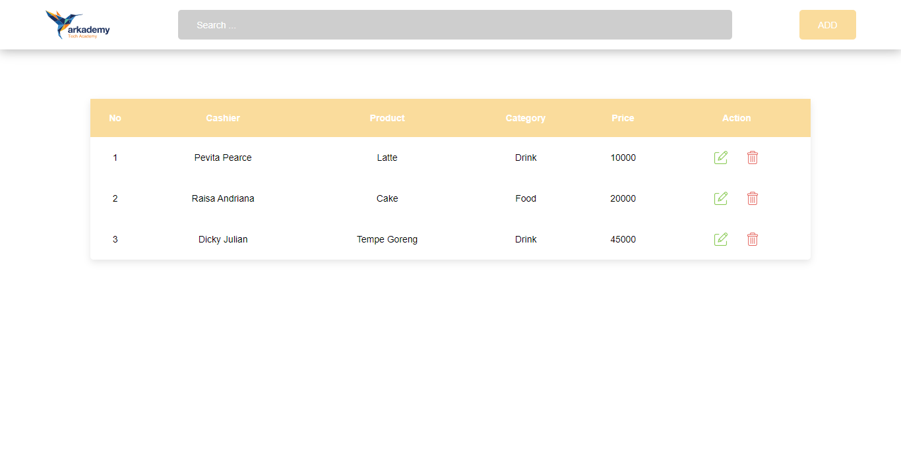
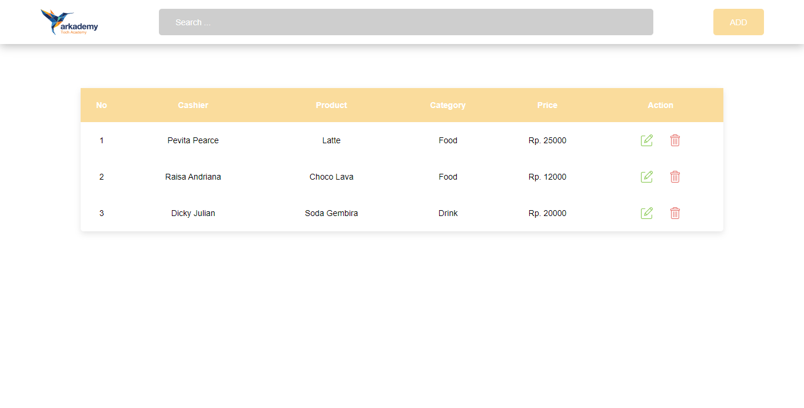

### How to Run Application ?
Open index file (index.html) in every folder

#### `Tools`
- Javascript
- Firebase Realtime Database
- Visual Studio Code

### Task to Do
#### 1. `Kegunaan JSON pada Rest API`
JSON (JavaScript Object Notation) adalah sebuah format data yang digunakan untuk pertukaran dan penyimpanan data. Alasan JSON banyak digunakan adalah karena JSON bisa dibaca dengan berbagai macam bahasa pemrograman seperti C, C++, C#, Java, Javascript Perl, Python, dan banyak lagi.

#### `Pada RESTful API`, JSON berfungsi sebagai format untuk bertukar data client dan server atau antar aplikasi. source : petanikode.com

### Screenshot

#### `6a`

#### `6b`

#### `6c`

